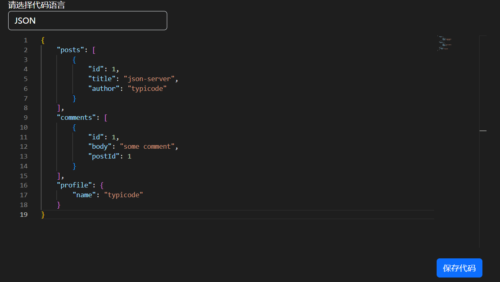
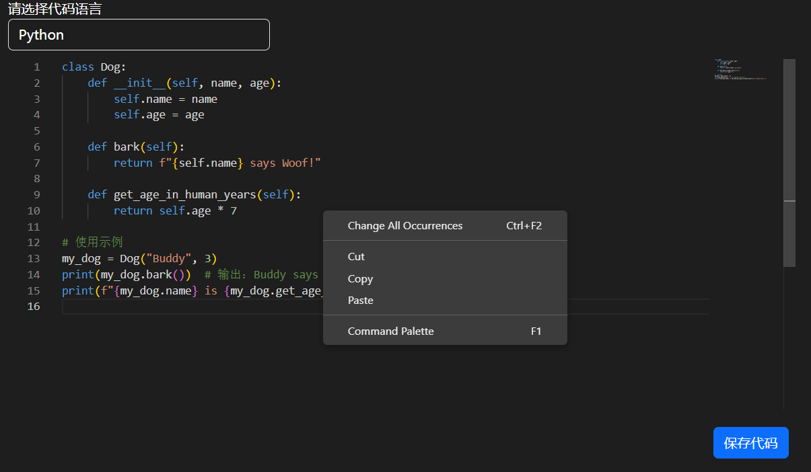
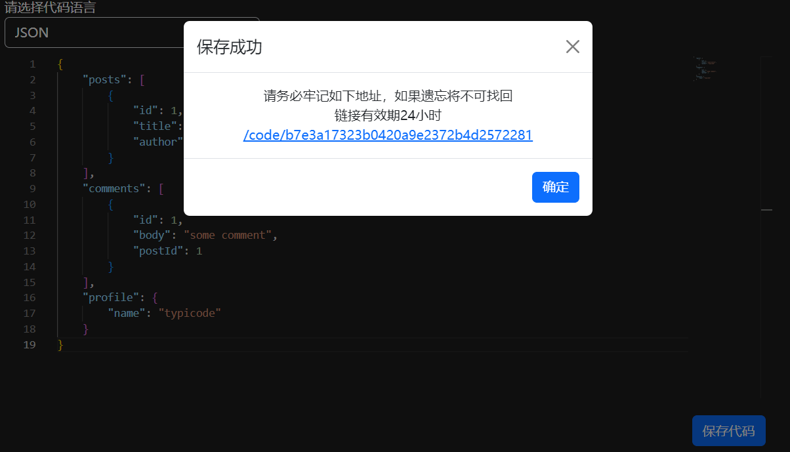
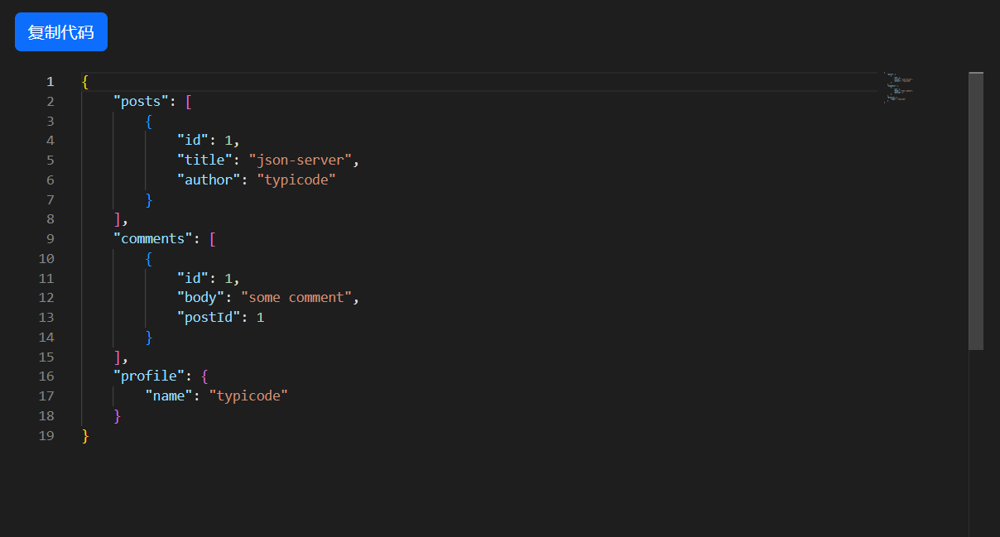

[README_EN](./README.md)

# CopyCode

临时的代码复制与粘贴，主要用于向他人提问时使用。这是一个由 AI 完全生成的娱乐项目。

## 介绍

这是一个完全由 AI 生成的项目。

我自己并不是前端工程师，当然，我了解一些前端知识，但在这个项目中，我的身份是“0 知识”来引导 AI 完成这项工作。

我仅仅参与了目录的组织和命令的执行。幸运的是，在给了 AI 大量的指导后，它成功完成了该项目。因此，这只是一个有趣的娱乐项目，当然，如果你不介意一些奇怪的问题，你也可以将它用于生产环境。

你可能会看到一些用奇怪方式编写的代码，或者某些方法被实现了多次。我没有干涉和修改代码，我认为这是 AI
的自主想法，尽管从人类的角度来看这不是最优的实现，或者违背了软件工程的设计模式。

如果你感兴趣，你可以尝试让 AI 自己优化代码，你只需要提供一些指导建议。

这个过程非常曲折，AI 不断修复自身的问题，但最终它成功了！

如果你看到这里，可能会觉得文本有些奇怪，不用担心，这个介绍也是 AI 自己写的。

## Dev 快速开始

前端

1、安装依赖包  
`npm install`

2、运行  
`npm run dev`

后端  
后端目录 `cd backend`

1、安装依赖  
`pip install -r requirements.txt`

2、运行  
`python main.py`

## 演示

**json 代码编辑界面**

**python 代码编辑界面**

**json code 保存界面**

**json code 只读查阅界面**

  
